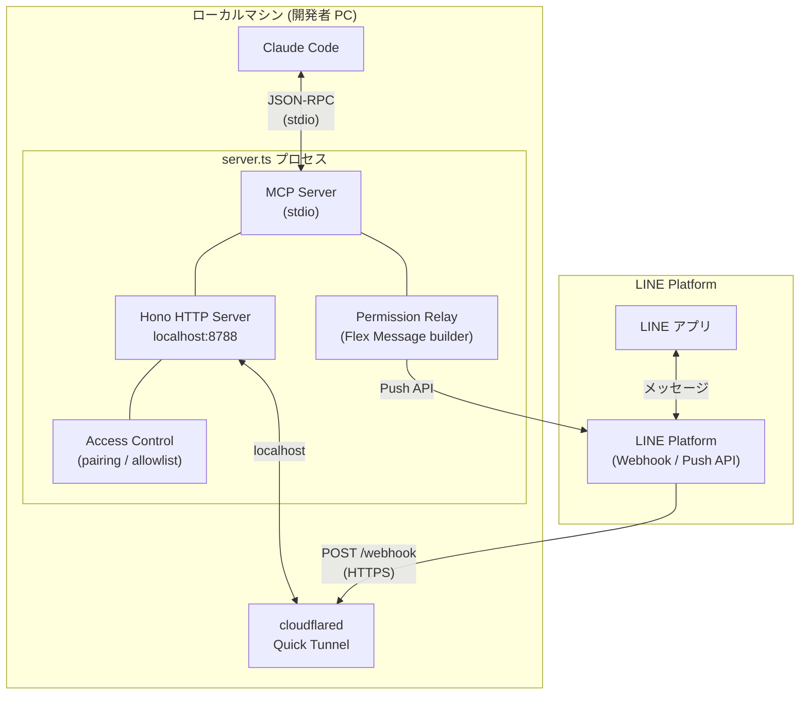
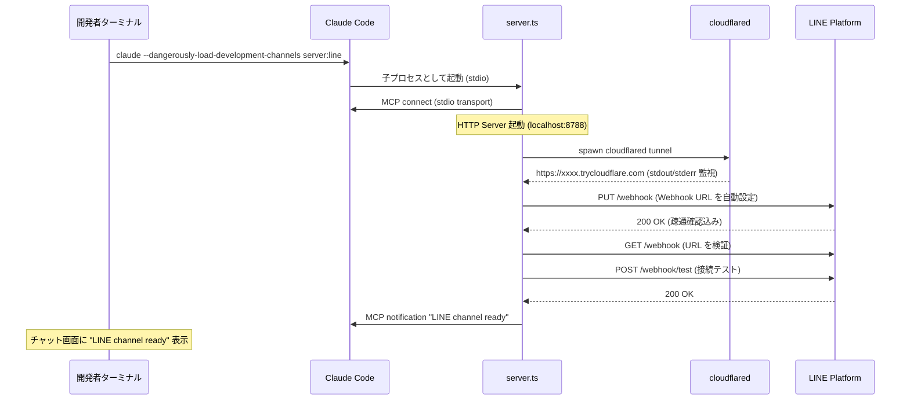
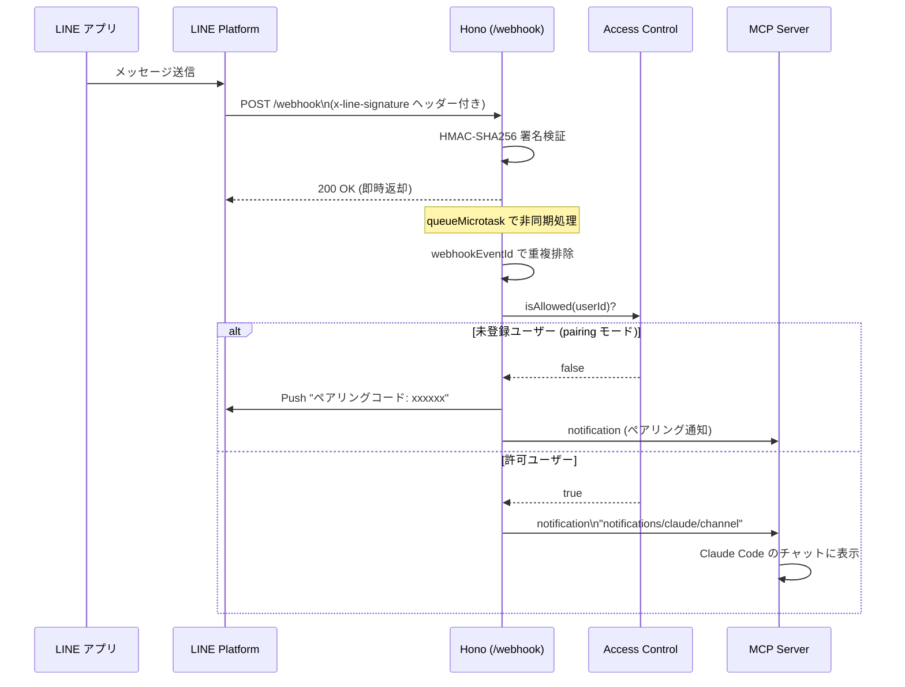
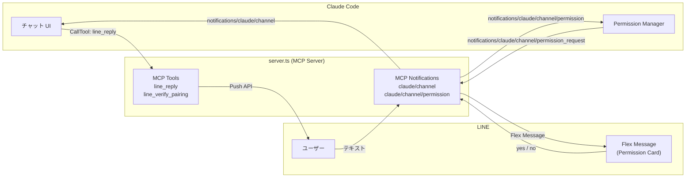
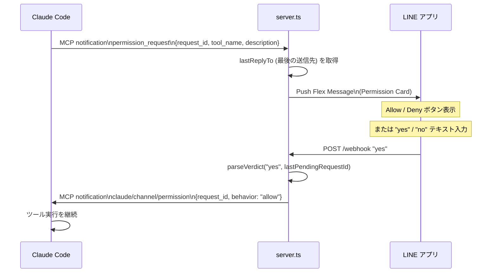
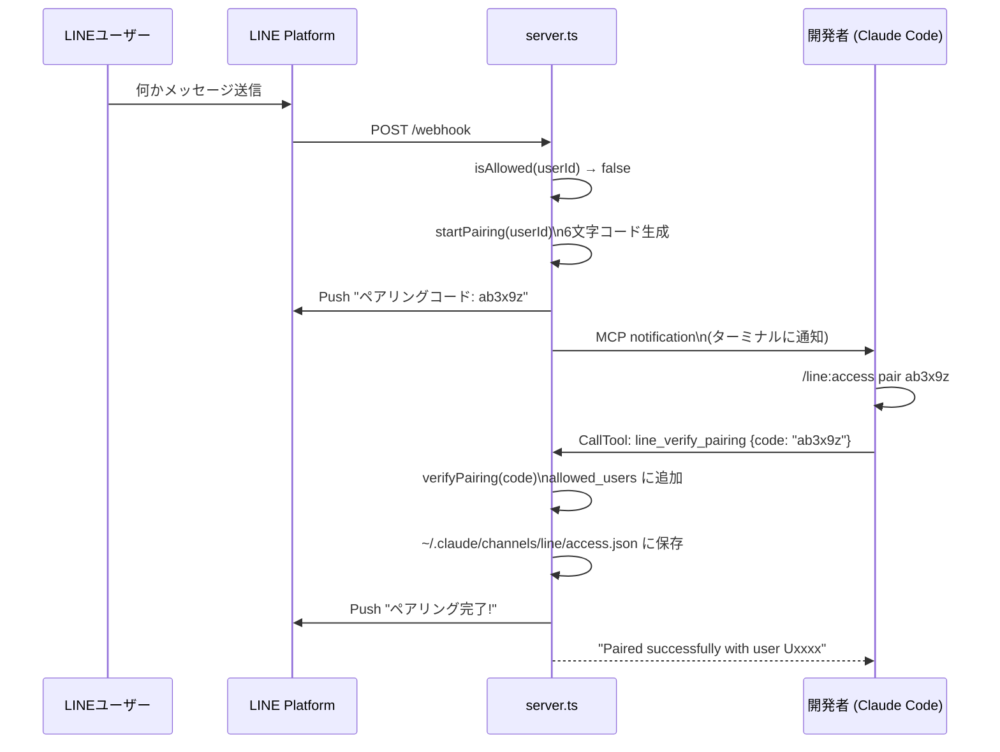
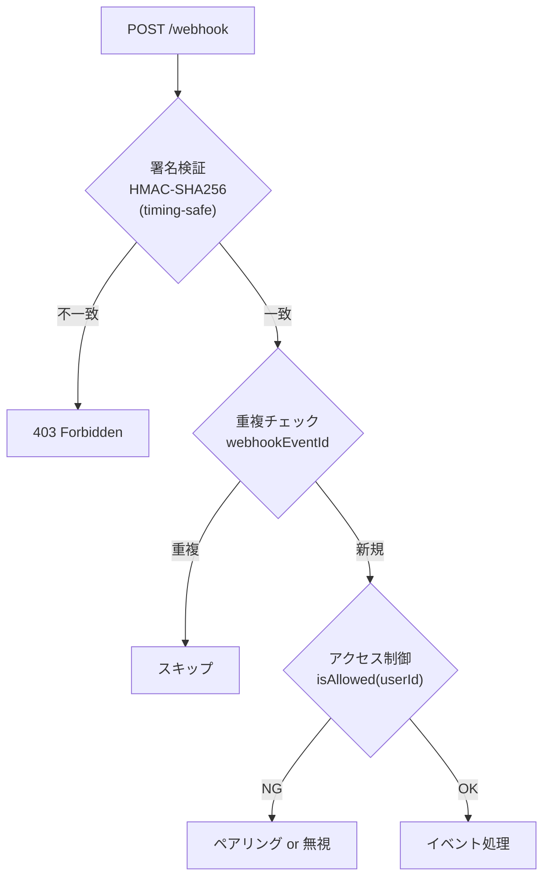
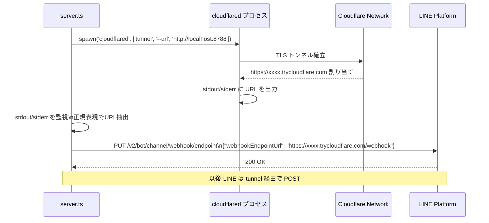

# line-to-cc アーキテクチャ解説

LINE Messaging API を **Claude Code の Custom Channel Plugin** として実装し、LINE から直接ローカルの Claude Code セッションを操作できるようにしたプロジェクトの技術解説です。

---

## 全体像



### コンポーネント一覧

| コンポーネント | 技術 | 役割 |
|---|---|---|
| **MCP Server** | `@modelcontextprotocol/sdk` | Claude Code との通信ブリッジ |
| **HTTP Server** | Hono on Bun | LINE Webhook の受信 |
| **cloudflared** | Quick Tunnel | localhost を HTTPS 公開 |
| **Access Control** | in-memory + JSON | ペアリング・sender gating |
| **Permission Relay** | Flex Message | Claude の許可要求を LINE に転送 |

---

## 起動フロー



> **設計ポイント**: MCP 接続を先に確立してから tunnel をセットアップすることで、「tunnel 完了」通知をチャットに届けられる。

---

## メッセージ受信フロー

LINE からメッセージが届いてから Claude Code のチャットに表示されるまでの流れです。



### 即時 200 返却の理由

```
LINE の公式推奨: Webhook 受信から 1 秒以内に 200 を返す
→ queueMicrotask() で処理を非同期に分離
→ HTTP レイヤーは検証のみ行いレスポンスを返す
→ イベント処理は次のマイクロタスクキューで実行
```

---

## MCP Protocol の活用

このプロジェクトの核心は Claude Code の **Custom Channel 機能** を MCP で実装している点です。



### MCP メッセージ一覧

| メッセージ | 方向 | 用途 |
|---|---|---|
| `notifications/claude/channel` | server → Claude Code | LINE メッセージをチャットに届ける |
| `notifications/claude/channel/permission_request` | Claude Code → server | ツール実行の許可要求 |
| `notifications/claude/channel/permission` | server → Claude Code | ユーザーの yes/no 判定を返す |
| `CallTool: line_reply` | Claude Code → server | Claude の返信を LINE に Push |
| `CallTool: line_verify_pairing` | Claude Code → server | ペアリングコードを承認 |

> **ポイント**: `notifications/claude/channel` は Claude Code 独自の拡張。  
> `capabilities.experimental['claude/channel']` として capability を宣言することで Claude Code に認識させる。

---

## Permission Relay フロー

Claude Code が危険なツール実行の許可を求めたとき、それを LINE に転送してモバイルから承認できます。



### Verdict パース仕様

```
"yes abcde"   → request_id 明示 (5文字コード)
"no"          → bare verdict (lastPendingRequestId を使用)
"y"           → "yes" の短縮形
```

> `'l'` を除いた小文字 a-z 5文字がコード形式。モバイルキーボードで `l` が `1` や `I` に見えるのを避けるため。

---

## ペアリングフロー

初回ユーザーを安全に追加する仕組みです。



### アクセスモード

| モード | 動作 |
|---|---|
| `pairing` | 初回メッセージでペアリングコードを発行 (デフォルト) |
| `allowlist` | ペアリング済みユーザーのみ許可 |
| `disabled` | 全員ブロック |

---

## セキュリティ設計



| 対策 | 実装 |
|---|---|
| **署名検証** | `crypto.subtle.verify` (WebCrypto API, timing-safe) |
| **Raw body 検証** | JSON parse 前に生バイト列で検証 |
| **Replay 攻撃対策** | `webhookEventId` で重複排除 (最大 1000件 in-memory) |
| **ネットワーク分離** | HTTP サーバーは `127.0.0.1` のみバインド |
| **プロセス分離** | cloudflared 起動時に既存プロセスを kill してポート競合防止 |

---

## cloudflared Quick Tunnel の仕組み

固定ドメインや認証なしで localhost を HTTPS 公開できる Cloudflare の無料機能を活用しています。



> **注意**: Quick Tunnel の URL はプロセス再起動ごとに変わる。  
> ただし LINE Webhook URL の自動更新で運用コストはゼロ。

---

## ファイル構成

```
src/
├── server.ts          # Orchestrator: MCP + HTTP + tunnel 起動・全配線
├── webhook.ts         # Hono: 署名検証・重複排除・イベントルーティング
├── line-api.ts        # LINE API クライアント: push・webhook設定
├── signature.ts       # HMAC-SHA256 署名検証 (WebCrypto)
├── access-control.ts  # ペアリング・sender gating・allowlist 管理
├── permission.ts      # Verdict パース + Flex Message ビルダー
├── tunnel.ts          # cloudflared spawn + URL 抽出
└── types.ts           # LINE Webhook イベント型定義・型ガード
```

---

## Tech Stack

| 技術 | 選定理由 |
|---|---|
| **Bun** | 高速な起動・組み込みテストランナー・Web API 互換 |
| **Hono** | 軽量・型安全・Bun ネイティブ対応 |
| **@modelcontextprotocol/sdk** | Claude Code との通信に必須 |
| **cloudflared** | 認証不要・無料・自動 HTTPS |
| **WebCrypto API** | timing-safe な署名検証・Node.js 依存なし |
